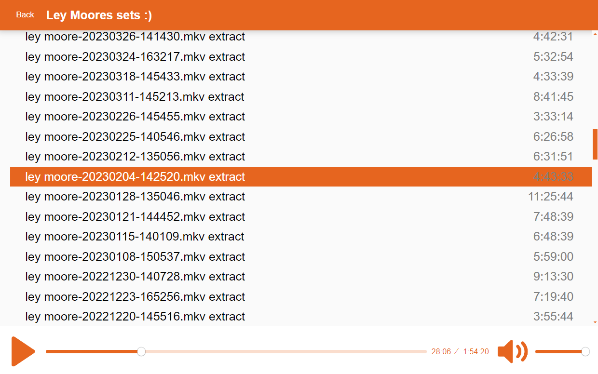

# HostMyTrack
This is a minimalist SoundCloud clone project that allows you to host and play audio tracks on your own website. The project uses the HLS.js and Plyr libraries to provide a smooth and customizable audio playback experience.

Thanks to HLS it works with very large files. We can stream multi hour long sets and it will only download the part you actually listen to.

## Screenshot

## Getting Started

To set up the project, follow these steps:

1. Clone this repository to your local machine.

2. Copy the `example.config.json` file and rename it to `config.json`. In `config.json`, you can configure:

   - `baseURL`: The base URL for your audio tracks. It here wher we expect `"/hls/" + trackNameNoExtension + "/output.m3u8"`
   - `jsonURL`: The URL to the JSON file containing your track data. Might be the same as `baseURL`
   - `websiteName`: The name of your website.

3. Customize your `config.json` file with the appropriate values.

4. Run the project on a web server to see your SoundCloud clone in action.

## Features

- Minimalist SoundCloud-like audio player from static website.
- Customizable website name and track data URLs.
- HLS.js for adaptive streaming and playback.
- Simple bash script to generate HLS data. 

## Additional Tools

- **FFmpeg HLS Script**: Included is an `ffmpeg_hls.sh` script that simplifies the process of converting audio files to HLS format. It iterates over all `.acc` files in a given directory, creates a folder for each track, and generates the necessary `.m3u8` and `.ts` files for HLS streaming.It also generates a `output.json` that we for the playlist.

## Todo

* **Screenshot**: Every project needs a screenshot.
* **Duration is broken**: sometimes it shows very long times. 🕵️‍♀️

## Dependencies

- The `ffmpeg_hls.sh` script needs `jq`, `ffprobe` and `ffmpeg` installed.
- [HLS.js](https://github.com/video-dev/hls.js): A JavaScript library for HLS playback.
- [Plyr](https://github.com/sampotts/plyr): A simple HTML5 media player that provides a customizable audio player interface.

## Contributing

Contributions to this project are welcome! Feel free to submit issues or pull requests if you have any improvements or suggestions.

## License

This project is licensed under the MIT License. See the [LICENSE](LICENSE) file for details.

---

**Note**: Make sure to properly configure the `config.json` file and set up your audio tracks and JSON data accordingly.
